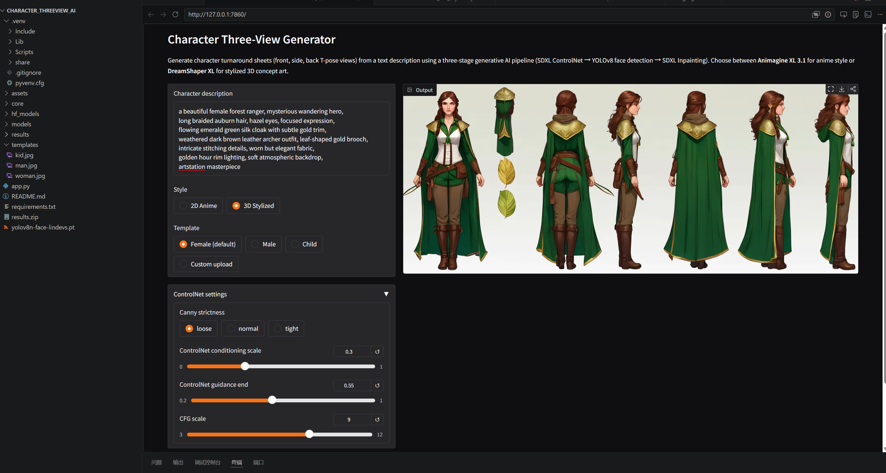
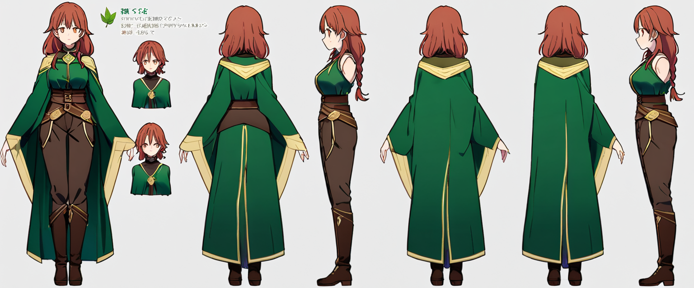
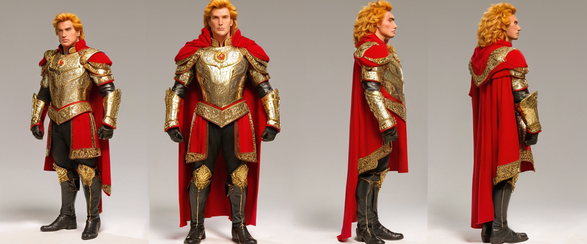

# Character Three-View Generator

A generative AI pipeline for producing character turnaround sheets (front, side, back T-pose views) from a text description. The system integrates **SDXL ControlNet**, **YOLOv8 face detection**, and **SDXL Inpainting** into a single three-stage workflow, with dynamic switching between two base models for distinct aesthetic styles.



## Overview

Character turnaround sheets are a foundational deliverable in game and animation pre-production. Off-the-shelf text-to-image tools fail at this task in two ways: they produce single hero shots rather than spatially structured multi-view layouts, and character identity drifts visibly across regenerations.

This project addresses both problems through a custom three-stage pipeline:

1. **SDXL ControlNet** generates a base layout using a Canny-edge skeleton derived from an anatomical template.
2. **YOLOv8** detects faces in the base output and filters out small artifact regions.
3. **SDXL Inpainting** refines each detected face with context-aware cropping and a Gaussian-blurred elliptical soft mask.

A dual base-model architecture dynamically swaps between **Animagine XL 3.1** (anime style) and **DreamShaper XL 1.0** (stylized concept art) according to user selection, with VRAM cleared between switches via Sequential CPU offload.

## Example Outputs

| 2D Anime (Animagine XL 3.1) | 3D Stylized (DreamShaper XL 1.0) |
|:---:|:---:|
|  |  |
| *Forest ranger archetype, anime style* | *Heroic knight archetype, concept art style* |

## Features

A Gradio interface exposes seven user-controllable parameters:

- Character description (text prompt)
- Style category (2D Anime / 3D Stylized)
- Template selection (three built-in anatomical references or custom upload)
- Canny strictness (loose / normal / tight)
- ControlNet conditioning scale and guidance end-step
- CFG scale
- Optional inpainting strength override

## Requirements

- Python 3.10+
- NVIDIA GPU with at least 12GB VRAM (tested on RTX 4090, 24GB)
- ~25GB free disk space for model downloads
- Windows / Linux

## Installation

```bash
# 1. Clone the repository
git clone https://github.com/RumengZhang000/Character-Three-View-Generator.git
cd Character-Three-View-Generator

# 2. Create a virtual environment
python -m venv .venv
# On Windows:
.venv\Scripts\activate
# On Linux/Mac:
source .venv/bin/activate

# 3. Install PyTorch (CUDA 12.1 build)
pip install torch torchvision --index-url https://download.pytorch.org/whl/cu121

# 4. Install remaining dependencies
pip install -r requirements.txt

# 5. Download YOLOv8 face weights
# Place yolov8n-face-lindevs.pt in the project root
# Available from: https://github.com/lindevs/yolov8-face
```

## Usage

```bash
python app.py
```

Then open `http://127.0.0.1:7860` (or whichever port Gradio reports) in a browser.

**First-run note**: The system downloads ~19GB of model weights from HuggingFace on first generation. Animagine XL (~6.5GB) is fetched the first time the 2D Anime style is selected; DreamShaper XL (~6.5GB) the first time 3D Stylized is selected; SDXL Inpainting and ControlNet (~12GB combined) are fetched as needed. All downloads cache to `./hf_models/`.

## Example Prompts

The pipeline performs best with concise prompts (30-50 tokens) that prioritize main character features. Examples:

```
# Anime style
1girl, solo, long silver hair, purple mage robe with gold trim,
violet eyes, blue magic crystal staff

# Stylized concept art
a fantasy paladin warrior, ornate red and gold plate armor,
flowing crimson cape, short blonde hair, blue eyes
```

Avoid verbose material descriptions (e.g. *weathered*, *rusted*, *mud-stained*) — these tend to trigger background scenery generation rather than affecting the character itself.

## Project Structure

```
Character-Three-View-Generator/
├── app.py                       Main application
├── requirements.txt             Python dependencies
├── yolov8n-face-lindevs.pt      YOLOv8 face detector weights (download separately)
├── figure_ui.png                Gradio interface screenshot
├── templates/                   Built-in anatomical templates
│   ├── woman.jpg
│   ├── man.jpg
│   └── kid.jpg
├── examples/                    Representative output images
│   ├── example_2d.png
│   └── example_3d.png
├── hf_models/                   HuggingFace model cache (auto-generated, gitignored)
└── results/                     Output images and JSON metadata (auto-generated, gitignored)
```

## Architecture

```
   User prompt + template
            │
            ▼
   ┌────────────────────┐
   │  Canny preprocess  │  (three strictness modes)
   └────────┬───────────┘
            │
            ▼
   ┌────────────────────────┐
   │  Stage 1               │
   │  SDXL ControlNet       │  ← Animagine XL / DreamShaper XL
   │  (base layout)         │
   └────────┬───────────────┘
            │
            ▼
   ┌────────────────────────┐
   │  Stage 2               │
   │  YOLOv8 face detection │  (filter small artifacts)
   └────────┬───────────────┘
            │
            ▼
   ┌────────────────────────┐
   │  Stage 3               │
   │  SDXL Inpainting       │  (context-aware face refinement)
   │  + elliptical soft mask│
   └────────┬───────────────┘
            │
            ▼
       Final image
```

## Development Methodology

The system was developed through an intensive iterative sprint comprising **210 logged generation runs** across **13 pipeline versions** (V0-pre through V20.x). Each run automatically logs prompt, seed, base model, detected face count, and timestamp as JSON metadata, enabling longitudinal analysis of pipeline behaviour. Eleven character archetypes were trialled, with Modern Soldier and Fantasy Mage serving as principal stress-test benchmarks for tactical accessories and flowing robe layouts respectively.

## Limitations

- **Hand rendering**: SDXL-family models share an unresolved hand-deformity issue that no prompt-engineering strategy fully corrects. Post-processing in image-editing software is recommended for production use.
- **CLIP token budget**: Prompt + layout + style instructions must fit within CLIP's 77-token cap. Verbose character descriptions can silently truncate critical layout tokens; the console emits a warning when this occurs.
- **Silhouette constraint**: ControlNet enforces the template silhouette strictly. Hair styles or accessories that significantly alter the body outline (e.g. twin tails, oversized armor) cannot be added if absent from the template.
- **Base-model bias**: Animagine XL's Danbooru training causes certain tokens (`lion`, `wolf`, `dragon`) to produce zoomorphic transformations rather than heraldic ornaments.
- **Stage 3 trigger rate**: At the current 1536×640 three-view canvas, face regions fall below the YOLO minimum-size filter in most runs, causing the face-refinement stage to remain inactive. Future revisions should scale canvas dimensions or relax the threshold.

## Acknowledgements

This project builds on the following open-source models and tools:

- Stable Diffusion XL (Podell et al., 2023) — Stability AI
- ControlNet (Zhang et al., 2023) — Lvmin Zhang
- Animagine XL 3.1 — Cagliostro Research Lab
- DreamShaper XL — Lykon
- YOLOv8 — Ultralytics
- SDXL Inpainting — diffusers team
- Gradio — Hugging Face

## License

Code: MIT License. Model weights are governed by their respective licenses on HuggingFace (most under OpenRAIL-M).
